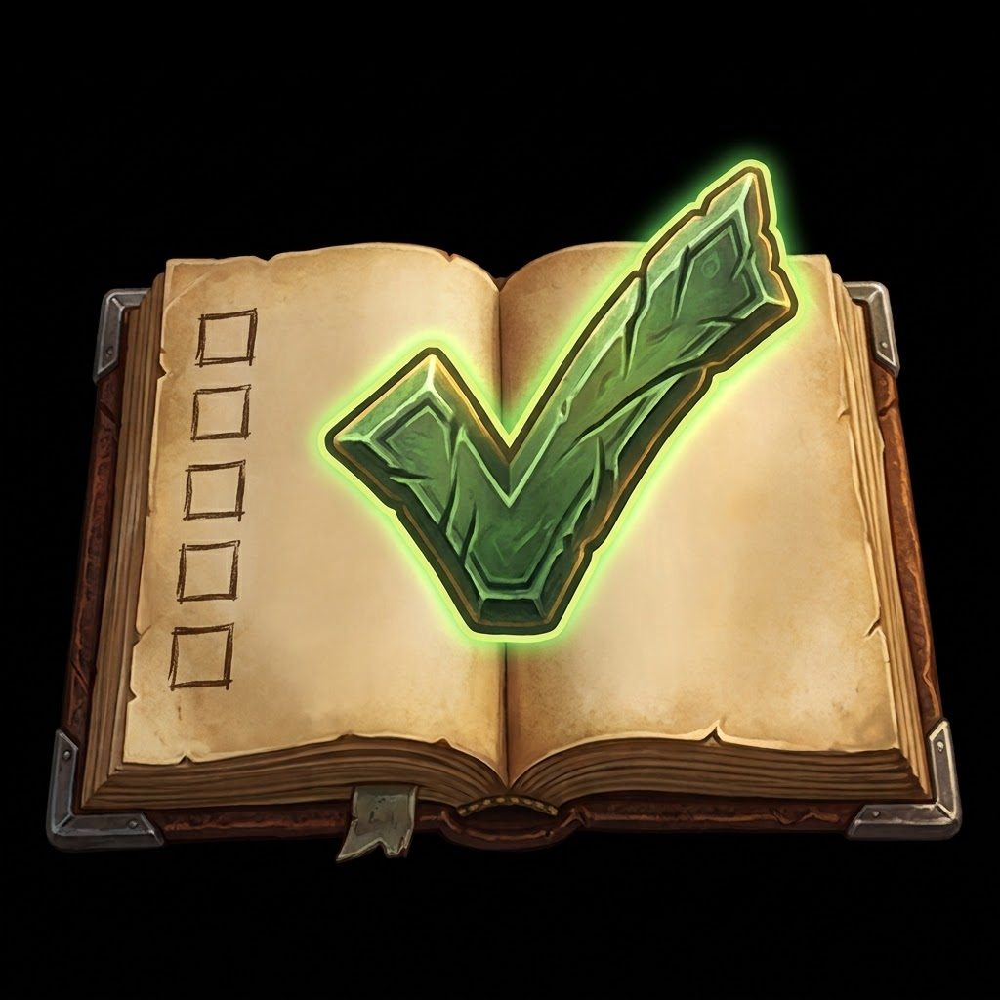

# Forever Goal Tracker

A goal tracker addon for **Warcraft Forever**. Choose long-term goals from a built-in library, follow step-by-step guides, and let the addon track your progress automatically across all of your characters. It also loads on Classic Era.

## Features

- **Goal suggestions:** a short welcome asks what interests you (Raiding, PvP, Epic Loot, Collecting, The Grind, Social) and picks starting goals for the character you're on: its class, race, faction and level.
- **Goal Library with 65 goals:** legendary and epic weapons, rare and class mounts, reputations, raid clears, raid attunements and dungeon keys, item sets (Dungeon Sets 1 and 2, Tier 1 to 3), professions, PvP ranks and milestones. Search by name or filter by type.
- **Step-by-step guides** for every goal.
- **Automatic tracking across your characters:** level and XP, items in bags, gear and bank, quests, reputation, professions, gold, mounts, PvP rank, honorable kills and raid boss kills.
- **Pick the parts you want** of multi-part goals: individual classes, professions, mount races or Tier set classes.
- **Separate Alliance and Horde goals**, with faction filters.
- **Favorites:** right-click a goal to star it and keep it at the top of your list, or to remove it.
- **Built for Warcraft Forever:** NEW and UPDATED markers in Forever blue, a "New & Updated" filter, and a notice on guides not yet confirmed in Forever.
- **Goal links:** steps and tips link to the goals they depend on; click one to add it.
- **Settings:** the gear in the title bar turns off chat lines, the banner or celebrations, adds a goal-complete sound, hides the minimap button, and sets window scale and opacity. Everything starts on.
- **Celebrations** when you finish a step, a group or a goal, plus a chat message and an on-screen banner when a goal finishes while the window is closed. A progress check-in greets you on login.

Made with the help of AI. Every change is tested in game and approved by a human before release.

## Roadmap

See what's coming next in [ROADMAP.md](ROADMAP.md).

## Install

Download the latest release from CurseForge, or copy this repository's files into
`World of Warcraft/_classic_beta_/Interface/AddOns/ForeverGoalTracker`, then restart the game.

## Usage

| Command | What it does |
|---|---|
| `/goals` (also `/fgt`, `/forevergoals`) | Open or close the window |
| `/goals reset` | Reset the window size and position |
| `/goals settings` | Open the Settings page |
| `/goals welcome` | Get goal suggestions for your character |
| `/goals testbanner` | Preview the goal-complete banner |

A key binding is available under Options > Keybindings > AddOns.

Click **Help me get started** for suggestions, or open the **Goal Library** tab and click **+ Add** on the goals you want, then follow them on **My Goals**. Steps tick themselves as you play; you can also click any step to tick it by hand.

## Project layout

| File | Contents |
|---|---|
| `Data.lua` | The original goal definitions and shared helpers |
| `Library.lua` | The rest of the Goal Library catalog |
| `Core.lua` | UI, tracking engine and saved data |
| `Media/` | Addon icons |
| `Fonts/` | Cinzel font (SIL Open Font License) |

## Releasing

Pushing a tag such as `v2.1.1` runs the GitHub Actions workflow in `.github/workflows/release.yml`, which packages the addon with the [BigWigs packager](https://github.com/BigWigsMods/packager) and uploads it to CurseForge. It needs a `CF_API_KEY` repository secret and the CurseForge project ID in the `.toc`.

## License

MIT, see [LICENSE.txt](LICENSE.txt). The Cinzel font is included under the SIL Open Font License (see `Fonts/OFL.txt`).
